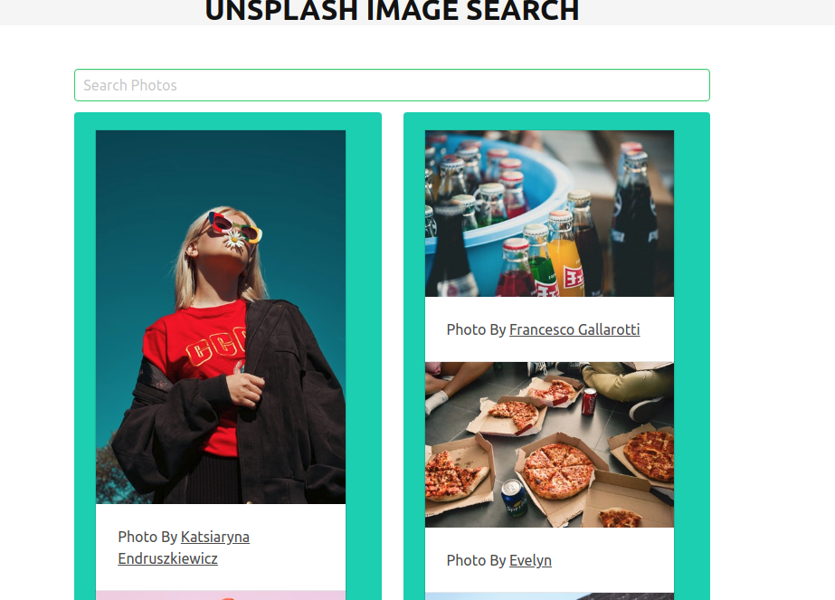

# unSplash-bulma-react

### A simple unSplash image searcher using react.js and the Bulma CSS UI react component

#### Sample Site : https://unsplash-react.firebaseapp.com/

Assuming you have npm installed,

### Usage  

- clone the repo

- Add your UNSPLASH API KEY in App.js

- npm install

- npm start (localhost)

### Screenshot

